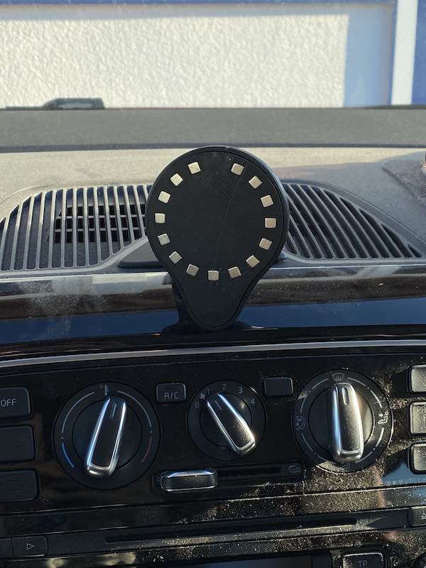

# Magnetic iPhone mount/charger for VW Up

This designs mounts to the VW Up nav system arm in place of the GPS head unit.

## Parts
- 15 neodymium cube magnets (edge length 4.7 mm, mine were advertised as 5 mm)
- OEM nav system arm
- (optional) Qi charging pcb + wiring

## Instructions
Print in ABS for sufficient heat resistance!

Insert magnets into the square holes of the face plate.
Pay attention to the proper polarity, all magnets must be oriented radially.
Give it some trial and error to determine the correct polarity.

**If you know what you're doing**, an electrical connection to a Qi charger can be established.
Check the dimensions form the STLs to determine the kind of charger you need - eBay and AliExpress have plenty of suitable options.
I won't go into the details since it might cause harm to your car and electronics but from the files it should be obvious.
Hint: it involves jump wires and some hot glue.